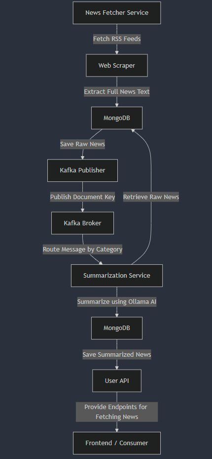

# 📰 News Feed Summary Application

## 📌 Overview

The **News Feed Summary Application** is a Spring Boot-based microservices system that:
- Fetches news articles from **RSS feeds** and **source websites**.
- Stores the news data in **MongoDB**.
- Publishes document references to **Kafka** based on news categories.
- Processes and summarizes news using **Ollama AI** and updates the database.

## 🔥 Features

✅ Fetch news from multiple RSS feeds.  
✅ Scrape full-text articles from given source URLs.  
✅ Store news articles in **MongoDB**.  
✅ Publish document IDs to **Kafka topics** based on categories.  
✅ Consume news and generate AI-based summaries using **Spring AI & Ollama**.  
✅ Deploy using **Docker Compose**.

---

## 🏗️ **Architecture Flow Diagram**


---

## 🛠️ **Tech Stack**

| Component | Technology               |
|-----------|--------------------------|
| **Backend** | Java 21, Spring Boot 3.4 |
| **Database** | MongoDB                  |
| **Messaging** | Apache Kafka             |
| **AI Summarization** | Ollama, Spring AI        |
| **Web Scraping** | Jsoup                    |
| **Scheduler** | Spring Scheduler         |
| **Build Tool** | Gradle                   |
| **Containerization** | Docker, Docker Compose   |

---

## 🏛 **Microservices Breakdown**

### 📰 **1. News Fetcher Service**
- Fetches news from RSS feeds.
- Scrapes full-text articles using **Jsoup**.
- Stores the news in MongoDB.
- Publishes **news document IDs** to Kafka topics based on categories.

### 🤖 **2. Summarization Service**
- Listens to Kafka topics.
- Fetches news data from MongoDB.
- Summarizes the news using **Ollama AI**.
- Updates the summarized news back to MongoDB.

### 🔧 **3. Kafka & MongoDB Configuration**
- Kafka topics are created dynamically.
- MongoDB is used for storing raw and summarized articles.

---

## 🏁 **Getting Started**

### **Prerequisites**
- Java 21+
- Docker & Docker Compose
- Apache Kafka & Zookeeper
- MongoDB
- Gradle

### **Installation & Setup**

**Clone the Repository**
```sh
git clone https://github.com/sureshkumarjha/news-feed-summarizer.git
cd news-feed-summarizer
```
**Start Docker Containers**
```sh
docker-compose up -d
```

**Run the Application**
```sh
./gradlew :news-fetcher-service:bootRun
./gradlew :summarization-service:bootRun
```

## 🛡️ Security & Best Practices
- Rate limiting to avoid overloading source websites.
- Error handling for failed news fetch operations.
- Retry mechanisms for Kafka consumers.
- MongoDB indexing for fast lookups.

## 🚀 Future Enhancements
- ✅ Improve AI-generated summaries using LLMs.
- ✅ Implement authentication & authorization.
- ✅ Cache frequently accessed news using Redis.
- ✅ Implement real-time UI dashboard.

## 🤝 Contributing
Want to contribute? Follow these steps:

- Fork the project.
- Create a new branch (git checkout -b feature-branch).
- Commit your changes (git commit -m "Added new feature").
- Push and create a PR!

### 📬 Contact
- 👨‍💻 Developer: Suresh Kumar Jha
- 📧 Email: sureshjha94@gmail.com
- 🌍 Website: https://sureshkumarjha.github.io/vue-profile-app/#/
